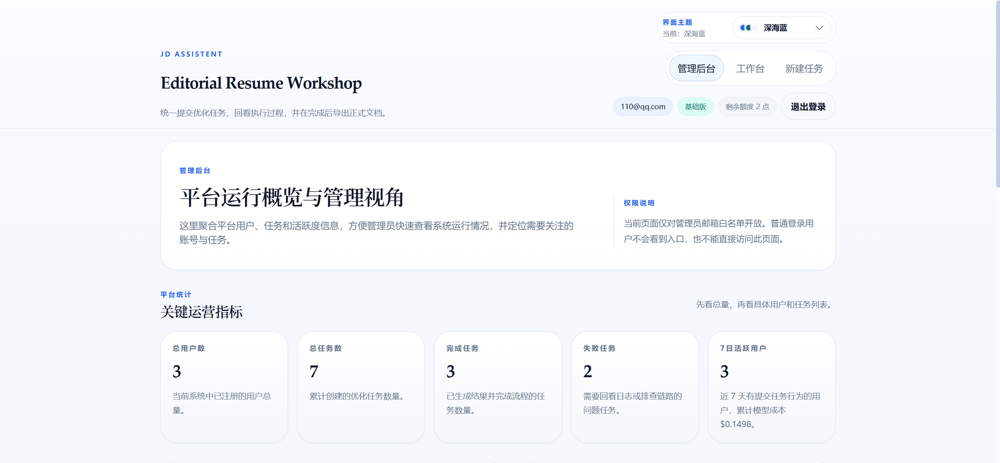
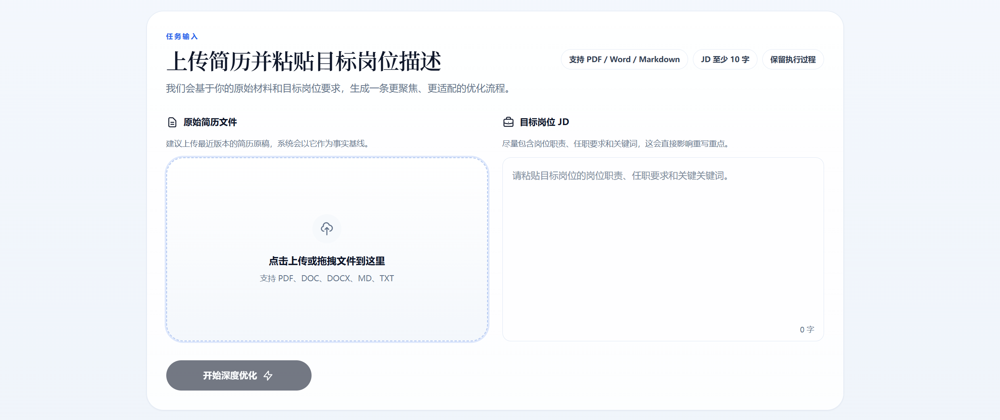
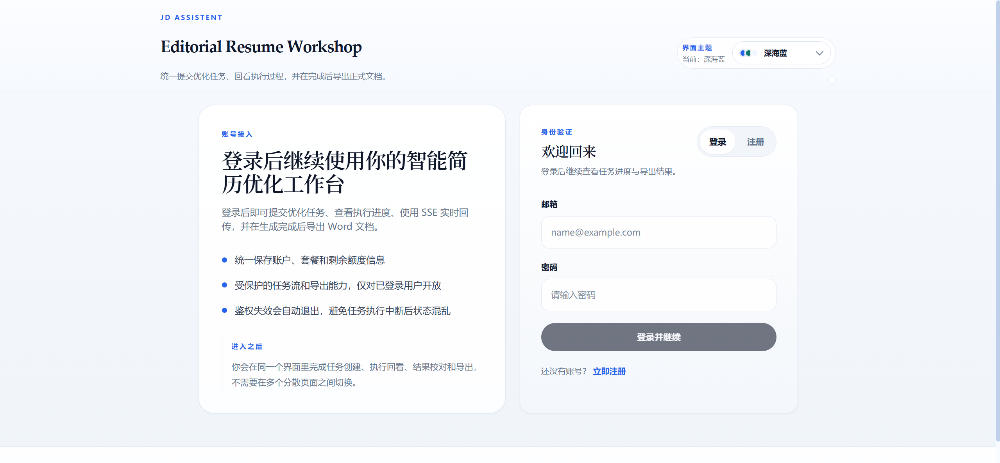

# JD Assistent

一个基于 Multi-Agent 工作流的智能简历优化系统。用户上传原始简历、粘贴目标岗位 JD 后，系统会完成岗位拆解、能力画像提取、内容优化、审查回路和最终排版，并在 Web 工作台中展示任务进度、结果预览和导出能力。

## 项目亮点

- 基于 **FastAPI + LangGraph** 的多节点简历优化流程
- 支持 **Vue 3 工作台**：登录、任务创建、任务历史、Dashboard、进度追踪
- 支持 **SSE 实时回传**，可观察任务执行中的节点状态
- 支持 **本地模式** 与 **Celery + Redis 异步模式**
- 支持 **Word 导出**，并在项目文档中规划了 PDF / 渲染链路
- 支持 **多主题前端界面**，适合不同查看场景

## 界面预览


### 预览图 1



### 预览图 2



### 预览图 3



## 适用场景

- 针对特定 JD 快速重写简历内容
- 在投递前做关键词对齐和经历表达优化
- 将简历优化流程做成可观察、可追踪的内部工具或 SaaS 原型

## 系统架构

整体由前端工作台、后端 API、任务调度层和 LLM 工作流组成：

```text
Frontend (Vue 3)
  ├─ 登录 / 注册
  ├─ 新建优化任务
  ├─ Dashboard / 历史任务
  └─ SSE 任务进度 + 结果预览

Backend (FastAPI)
  ├─ /api/v1/auth      认证接口
  ├─ /api/v1           简历优化接口
  ├─ /api/v1/admin     管理接口
  └─ /health           健康检查

Task Execution
  ├─ local             本地内存/进程内执行
  └─ celery + redis    分布式异步执行

LLM Workflow
  ├─ 画像构建
  ├─ JD 分析
  ├─ 内容优化
  ├─ 内容审查
  └─ 终审排版
```

## 技术栈

### 后端

- Python 3.13
- FastAPI
- SQLAlchemy Async + Alembic
- Celery + Redis
- LangChain / LangGraph
- python-docx
- PyJWT / pwdlib

### 前端

- Vue 3
- Vite
- Pinia
- Vue Router
- Tailwind CSS

## 仓库结构

```text
jd-assistent/
├── backend/               # FastAPI、任务调度、服务层、测试
├── frontend/              # Vue 3 前端工作台
├── docs/                  # 开发文档、阶段记录、重构计划
├── alembic/               # 数据库迁移
├── docker-compose.yml     # Redis + API + Worker 编排
├── Dockerfile             # 后端镜像
├── .env.example           # 环境变量示例
└── README.md
```

## 核心能力

### 1. 简历优化任务流

后端通过 LangGraph 风格的多节点工作流，对原始简历和目标 JD 进行结构化处理，输出更适配岗位的结果。

### 2. 任务可观测性

前端任务页可以看到节点执行过程、运行状态和审查打回日志，而不只是等待最终结果。

### 3. Dashboard

系统提供工作台数据汇总，包括：

- 历史任务统计
- 积分/额度变化趋势
- 用户画像摘要
- 最近任务历史

### 4. 认证与用户隔离

系统已具备用户注册、登录、当前用户信息查询，以及面向用户维度的数据访问隔离设计。

## 快速开始

### 方式一：本地开发

#### 1）准备环境变量

复制配置文件：

```bash
cp .env.example .env
```

至少需要配置：

- `LLM_PROVIDER`
- `LLM_MODEL`
- `LLM_API_KEY`

如果你使用本地开发默认模式，可以保留：

- `TASK_DISPATCHER_MODE=local`
- `SSE_EVENT_BUS_BACKEND=memory`

如果你希望任务在 API / Worker 分进程运行、并在切换页面后仍能稳定恢复进度追踪，建议改为：

- `TASK_DISPATCHER_MODE=celery`
- `SSE_EVENT_BUS_BACKEND=redis`
- `LANGGRAPH_CHECKPOINT_BACKEND=redis`

#### 2）启动后端

安装依赖：

```bash
pip install -r backend/requirements.txt
```

启动 API：

```bash
uvicorn backend.main:app --reload --host 0.0.0.0 --port 8000
```

#### 3）启动前端

```bash
cd frontend
npm install
npm run dev
```

前端开发服务器默认由 Vite 启动。

### 方式二：Docker Compose

如果你希望使用 Redis + Celery 的异步执行模式，直接使用 Docker Compose：

```bash
docker compose up --build
```

当前编排会启动：

- `redis`
- `api`
- `worker`

其中：

- API 运行在 `8000`
- Worker 使用 `celery -A backend.worker.celery_app:celery_app worker --loglevel=info`

## 常用命令

### 后端测试

```bash
pytest backend/tests
```

### 前端构建

```bash
cd frontend
npm run build
```

### 健康检查

```bash
curl http://127.0.0.1:8000/health
```

## 环境变量说明

`.env.example` 已提供示例，关键字段包括：

### LLM 配置

- `LLM_PROVIDER`
- `LLM_MODEL`
- `LLM_API_KEY`
- `LLM_BASE_URL`
- `LLM_TEMPERATURE`
- `LLM_MAX_TOKENS`

### 服务配置

- `API_HOST`
- `API_PORT`
- `DEBUG`
- `DATABASE_URL`

### 任务调度配置

- `TASK_DISPATCHER_MODE=local|celery`
- `CELERY_BROKER_URL`
- `CELERY_RESULT_BACKEND`

说明：

- `local` 适合单进程本地开发，零额外依赖。
- `celery` 适合需要跨进程持续执行的场景，建议与 Redis 事件总线、Redis checkpoint 一起使用。

### SSE / Redis 配置

- `SSE_EVENT_BUS_BACKEND=memory|redis`
- `REDIS_URL`
- `SSE_REDIS_CHANNEL_PREFIX`

### LangGraph Checkpoint 配置

- `LANGGRAPH_CHECKPOINT_BACKEND`
- `LANGGRAPH_CHECKPOINT_REDIS_URL`
- `LANGGRAPH_CHECKPOINT_REDIS_KEY_PREFIX`

## 当前状态

从当前仓库内容来看，项目已经具备：

- 后端 API 与任务调度基础设施
- 用户认证与 Dashboard 能力
- Vue 3 前端工作台
- Docker Compose 异步执行方案
- 较完整的后端测试文件

同时，`docs/` 下保留了开发文档、阶段记录和后续 SaaS 化重构计划，适合继续演进为更完整的平台产品。

## 相关文档

- `docs/开发文档.md`：系统整体设计与开发文档
- `docs/重构计划.md`：SaaS 化演进路线
- `frontend/README.md`：前端模块说明

## Todo

- [ ] 模型面试

## License

MIT
